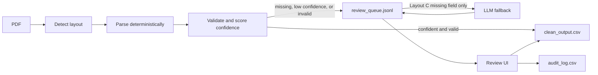

# Document Extraction With a Review Queue

Extracts structured data from elevator inspection certificate PDFs across
three inconsistent layouts, validates it, and routes anything uncertain to
a human review queue instead of silently guessing. Built against a
36-document synthetic corpus (`sample-data/inspection-certs/`) with a
`GROUND_TRUTH.csv` key, so accuracy is measured, not estimated. A few
documents are deliberately missing their capacity field; the correct
behavior is to flag them for review, never invent a value.

## How it works



Each PDF is classified by layout, parsed deterministically (no LLM), and
validated against a schema with type and business-rule checks. Every field
gets a confidence score. Records that are missing a field, low confidence,
or fail validation go to a review queue instead of clean output. For
Layout C documents genuinely missing a field the deterministic parser
can't get, a Claude Haiku 4.5 call with structured output attempts a
fallback value, still flagged for review rather than trusted outright. A
small Streamlit app shows the PDF beside the extracted fields so a
reviewer can approve or correct it; every decision is written to an audit
log with who, what, when, and the old and new value. A record can't leave
the queue with an unresolved field still blank.

## Verified results

- Extraction accuracy: 468/468 fields (100%) across all 36 documents, 100%
  for each layout and each field, measured against `GROUND_TRUTH.csv`.
- Layout detection: 36/36 (100%) correct.
- All 4 documents missing capacity are routed to review, none fabricated.
- Review queue routing: 32 clean, 4 review, matching the missing-capacity
  documents exactly.
- Review workflow (display, correction, audit logging, and the gating
  that blocks unresolved fields) manually verified end to end.
- LLM fallback (Stage 5, one real run against all 4 affected documents):
  correctly returned null on every document rather than fabricating a
  value, matching the deterministic result exactly (4/4 accuracy with and
  without the fallback). Total cost $0.0045 ($0.0011/doc), total latency
  5.3s (1.3s/doc). The fallback added cost and latency for no accuracy
  gain on this corpus, since the source documents genuinely lack the
  field.
- Idempotency: reprocessing the same PDF, and the full 36-document corpus,
  twice produces byte-identical output with no duplicate or mutated
  records (verified for the deterministic pipeline; not tested for the
  LLM fallback, which is not guaranteed deterministic).

## Running it

```
pip install pdfplumber pydantic streamlit anthropic python-dotenv
python evaluate.py          # accuracy report against GROUND_TRUTH.csv
python pipeline.py          # run the corpus, produce clean_output.csv / review_queue.jsonl
python -m streamlit run review_ui.py  # review queued records
python stage5.py            # LLM fallback for Layout C's missing field, costs real API usage
```

`stage5.py` requires `ANTHROPIC_API_KEY` in a local `.env` file (gitignored,
never committed).

## Known limitations

- Confidence is binary and rule-based, not a probability; no probabilistic
  model informs it.
- The LLM fallback is not guaranteed deterministic and re-running it
  spends real API cost again; it has not been tested for idempotency.
- The LLM fallback's output is measured separately (`stage5_results.jsonl`)
  and is not yet fed back into the review queue or UI, so a reviewer does
  not see the LLM's suggested value.
